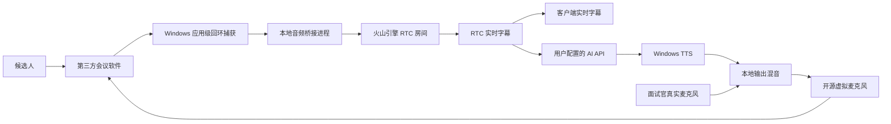

# 火山引擎 RTC 音频桥接设计修订

日期：2026-08-10  
状态：用户已确认  
上位设计：`2026-08-10-windows-desktop-client-design.md`

## 1. 修订范围

本修订替换上位设计中的通用在线语音识别方案，但不改变第三方会议软件、OBS Virtual Camera、Electron 客户端和开源虚拟音频设备的总体方向。

候选人仍通过腾讯会议、飞书、钉钉、Teams 等任意第三方会议软件参加面试。火山引擎 RTC 不承担候选人会议入口，只承担捕获音频的实时传输与字幕生成。

AI 模型供应商和模型名称均不写死，由使用者在客户端配置 OpenAI 兼容 API 地址、API Key、模型名称和可选参数。

## 2. 音频与字幕链路

Windows 10/11 优先使用微软官方 Application Loopback API 按进程树捕获所选会议软件，避免系统通知音和 AI 自身输出进入字幕。该能力要求满足微软标注的系统构建版本；不满足时允许用户明确选择“捕获整个输出设备”降级模式，并显示可能误识别系统声音的警告。

本地桥接进程将 PCM 音频转换为火山 RTC SDK 要求的采样率、声道数和帧长，通过自定义音频源推入一个仅用于字幕的 RTC 房间。进入房间后调用实时字幕能力；客户端接收增量字幕和最终字幕回调。

增量字幕只用于实时显示，最终字幕才进入面试记录、AI 上下文和报告。每条字幕保存时间戳、是否最终结果、来源进程和会话 ID；默认不保存原始音频。

## 3. RTC 鉴权与配置

客户端设置包括 RTC AppID、房间 ID、用户 ID、字幕语言、Token 服务地址和临时 Token。正式模式只接受企业 Token 服务签发的短期 Token，客户端不保存 RTC AppKey。

少量用户试用阶段允许粘贴控制台生成的临时 Token，但必须显示“仅限试用”、到期时间和重新配置提示。AppID、非敏感字幕参数可普通保存；Token 使用 DPAPI 加密。

火山引擎 RTC SDK 属商业在线服务依赖，其 SDK 许可、下载方式、计费、数据地域、隐私条款和重分发条件必须在接入前由官方资料确认并记录。若 SDK 不允许随开源仓库或安装包重分发，只提交适配接口与下载引导，不提交 SDK 二进制。

## 4. 监听与人工介入

使用者在运行客户端的同一台电脑监听。候选人声音继续由第三方会议软件正常播放；客户端不重放捕获音频，防止双声和回声。

人工介入采用按住说话：

1. 按下介入键后停止新的 AI 请求，并中止或快速淡出当前 TTS。
2. 将真实麦克风接入本地输出混音，再送往虚拟麦克风。
3. 松开后断开真实麦克风输出。
4. AI 保持暂停，必须由使用者明确点击“恢复 AI”。

界面同时提供暂停 AI、恢复 AI、按住说话、全部静音和结束面试。人工介入期间不得触发自动追问；真实麦克风不得被发送到火山字幕房间，避免把面试官的话误记为候选人回答。

## 5. 音频输出混音

AI TTS 与人工麦克风共享一个本地混音器，但采用互斥策略：人工介入优先，介入开始即淡出 AI。混合后的单路音频写入开源虚拟音频设备，由第三方会议软件选择其麦克风端点。

客户端显示候选人捕获电平、RTC 上行电平、AI TTS 输出电平、人工麦克风电平和虚拟麦克风输出电平。任何关键链路无信号时禁止开始自动面试。

## 6. 故障与安全

- 所选会议进程退出时立即停止捕获并暂停 AI。
- RTC Token 过期、字幕服务未开通或网络断开时保留本地监听和人工介入，但停止自动 AI 回答。
- 字幕回调乱序时按服务端序号和时间戳归并；最终结果不可被后续增量结果覆盖。
- 捕获辅助进程、RTC SDK 和虚拟驱动均以最小权限运行，只有驱动安装需要管理员权限。
- 客户端明确提示候选人音频会发送至火山引擎，并要求使用者确认已履行告知和同意义务。
- 日志不记录 Token、完整字幕或原始 PCM。

## 7. 依赖决策

- 应用级音频捕获优先采用微软官方 Windows Classic Samples 中 ApplicationLoopback 的接口模式，通过独立、最小的原生辅助进程适配；不复制大段示例源码。
- RTC 接入优先使用火山引擎官方 Electron 或 Windows SDK。若 Electron SDK 无法接收外部 PCM 或缺少字幕 API，则采用官方 Windows SDK 原生 sidecar，不叠加第三方 RTC 封装库。
- 字幕使用 RTC 官方 `startSubtitle`/字幕回调能力，不再保留通用在线转写作为首选路径。
- AI 保留 OpenAI 兼容协议适配层，不固定域名、供应商或模型。

## 8. 新增验收

- 分别验证腾讯会议、飞书或钉钉、Teams 中至少两种会议软件的按进程捕获。
- 验证实时增量字幕、最终字幕归并、Token 到期和字幕断线恢复。
- 验证监听无双声、AI 声音不回灌字幕、人工介入不被识别为候选人。
- 验证按下人工介入后 AI TTS 在可接受时间内停止，松开后 AI 不自动恢复。
- 验证应用级捕获不支持时的全设备捕获警告和就绪门禁。
- 验证未配置固定 AI 模型仍可保存设置，并能切换不同 OpenAI 兼容服务。
