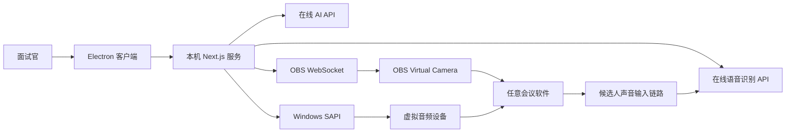

# Windows 桌面客户端设计

日期：2026-08-10  
状态：用户已确认口头设计，待书面评审  
目标平台：Windows 10/11 x64  
使用范围：少量内部用户，首版支持单候选人面试

## 1. 背景与目标

现有项目是基于 Next.js 的 AI 面试控制台，已经具备面试会话、在线模型与语音识别接入、Windows TTS、面试官画面、OBS WebSocket 控制、虚拟摄像头就绪检查、归档与报告等能力。

本次改造的目标是将它交付为低门槛 Windows 客户端。使用者通过一个安装包完成客户端、OBS 和虚拟音频能力的安装；日常只需启动一个桌面图标。客户端生成的面试官画面通过标准虚拟摄像头提供给任意会议软件，AI 语音通过标准虚拟音频设备提供给会议软件。

本项目不自行开发摄像头驱动，不内置本地大模型，也不依赖需要购买商业授权或输入激活码的组件。所有开源组件依法附带许可证、版权声明和必要的源码获取信息。

## 2. 范围

### 2.1 首版包含

- Windows 10/11 x64 桌面客户端。
- 单人面试流程。
- 在线 AI API 和在线语音识别 API。
- 上传或选择面试官画面。
- 通过 OBS Virtual Camera 向会议软件输出画面。
- 通过开源虚拟音频设备向会议软件输出 AI 语音。
- OBS、虚拟设备、API 和会议软件交接检查。
- 面试记录、结构化评分和报告。
- 安装失败恢复、升级和卸载路径。

### 2.2 首版不包含

- 多候选人并行面试。
- 本地大模型或本地语音识别模型。
- 自研虚拟摄像头或虚拟音频驱动。
- 自动修改所有第三方会议软件的设备设置。
- 默认录制候选人原始音视频。

## 3. 依赖优先原则

任何实现工作开始前，必须按 `AGENTS.md` 调查并记录现有能力、官方 SDK 和成熟开源依赖。最终依赖及固定版本写入 `docs/dependency-decisions.md`。

当前设计采用以下方向：

| 能力 | 方案 | 原因与边界 |
| --- | --- | --- |
| 桌面壳 | Electron | 保留现有 Next.js 服务端 API，Windows 集成和进程管理路径直接 |
| 画面输出 | 官方 OBS Studio 与 OBS Virtual Camera | 使用成熟标准摄像头设备接口，不自研驱动 |
| OBS 控制 | 现有 OBS WebSocket 集成 | 复用现有场景、浏览器源和虚拟摄像头控制能力 |
| 音频输出 | 经验证且正式签名的开源虚拟音频驱动 | 避免需商业分发许可的组件；未通过签名验收不得发布 |
| AI | 用户配置的在线 API | 不增加本地模型体积和硬件要求 |
| 语音识别 | 用户配置的在线 API | 不打包 Whisper 模型和运行环境 |
| TTS | 现有 Windows SAPI | 复用系统能力，降低安装体积 |
| 密钥保护 | Windows DPAPI | 密钥只在当前 Windows 用户环境解密 |

打包工具、Electron 版本、OBS 版本和音频驱动版本在实施前再次核验稳定版本、许可证、维护状态、安全问题、重分发条件和 Windows 兼容性。安装器需要支持前置组件检测、管理员提权、重启续装和升级回滚；具体打包依赖以调研结果为准，不为了锁定工具而自行编写一套安装框架。

## 4. 总体架构

Electron 主进程负责：

- 保证客户端单实例运行。
- 选择可用的随机本地端口并启动打包后的 Next.js 服务子进程。
- 创建客户端窗口并只加载本机服务。
- 检测、启动和连接 OBS。
- 管理首次安装、重启续装、日志和进程生命周期。
- 只停止由当前客户端启动的进程，不关闭用户原先启动的 OBS。

渲染进程采用 `nodeIntegration: false`、`contextIsolation: true`、`sandbox: true`。只通过预加载脚本暴露最小化、白名单式 IPC，不向页面暴露任意文件、Shell 或进程执行能力。

现有 Next.js 后端继续负责会话、API 调用、语音、画面资源、OBS 业务控制、就绪门禁、归档和报告。服务只绑定回环地址，不开放局域网访问。

## 5. 安装与首次启动

一个 Windows 安装包包含：

- Electron 客户端和打包后的 Next.js 应用运行资源。
- 固定版本的官方 OBS 安装器。
- 固定版本且正式签名的开源虚拟音频驱动安装器。
- Windows x64 所需资源。
- 全部许可证、版权声明和源码获取信息。

首次启动按可恢复状态机执行：

1. 安装客户端。
2. 检测 OBS；缺失时调用随包提供的官方安装器。
3. 检测 OBS Virtual Camera；缺失时使用 OBS 官方注册方式，经用户确认后申请管理员权限。
4. 检测虚拟音频设备，显示驱动风险、数据路径和恢复说明，经用户确认后申请管理员权限安装。
5. 持久化每一步结果；需要重启时给出明确提示。
6. 重启后自动恢复到尚未完成的步骤，不重复成功步骤。
7. 引导用户配置在线 AI、在线语音识别的服务地址、模型和 API Key。
8. 使用 DPAPI 加密保存密钥。
9. 引导上传面试官画面并完成画面、声音和会议软件测试。

日常使用只启动一个桌面图标。客户端自动启动本地服务和所需的 OBS 实例、配置场景并准备虚拟摄像头。

卸载默认只删除客户端，OBS、驱动和用户数据默认保留。高级清理提供分别移除 OBS、驱动和数据的选项，并要求二次确认。

## 6. 日常使用与数据流

首页提供一张开播检查卡，逐项显示：

- 在线 AI API 可用性。
- 在线语音识别可用性。
- OBS 连接状态。
- 虚拟摄像头实际画面预览。
- 虚拟音频设备实际信号。
- 用户是否确认已在会议软件中选择正确设备。

用户选择面试官画面，填写职位、问题规则和候选人信息后开始面试。客户端把本地舞台地址按运行时端口写入 OBS 浏览器源，OBS 将合成画面输出到 `OBS Virtual Camera`。会议软件只需选择这个标准摄像头设备。

AI 生成的回答通过 Windows SAPI 合成语音，经虚拟音频设备进入会议软件的麦克风线路。候选人的声音从会议软件播放链路进入捕获流程，发送给在线语音识别 API；转写结果再发送给在线 AI API，以生成追问、评分和记录。

面试中始终显示三个高优先级控制：暂停 AI、人工接管、立即停止画面和声音。API 不可用时自动停止追问并保留人工接管能力。

面试结束后保存转写、结构化结果和报告。原始音频默认不保存；若用户主动开启录音，界面必须提示先取得候选人同意。

## 7. 本地数据与端口

- 用户配置、会话和报告存放于 `%APPDATA%\AI Interviewer`，不放在安装目录。
- 升级不覆盖用户数据；首次客户端化可提供现有工作区数据的一次性迁移。
- 本地服务使用运行时选择的空闲端口，Electron 将实际地址传递给窗口和 OBS 场景。
- 使用单实例锁，防止重复服务、端口和虚拟设备冲突。
- 日志按大小或日期轮转，过滤 API Key、令牌、候选人隐私和完整回答。

## 8. 会议软件兼容边界

客户端通过 Windows 标准摄像头和音频设备接口工作，因此不绑定某一种会议软件。首次使用腾讯会议、飞书、钉钉、Teams、Zoom 或网页会议时，用户仍需在会议软件中手动选择 `OBS Virtual Camera` 和指定的虚拟麦克风。

客户端不尝试绕过第三方软件权限或强制修改其设置。它提供带实时预览和音量指示的引导，并要求用户明确确认设备选择；该确认完成前，就绪门禁不允许开始正式面试。

## 9. 安全与隐私

- 所有在线 AI 和语音识别请求必须使用 HTTPS。
- API Key 通过 DPAPI 加密，不写入前端源码、日志、安装包或版本库。
- 默认不向在线模型上传视频，只发送完成任务所需的文本或音频。
- 设置页明确显示当前数据会发送给哪家供应商。
- Electron 页面执行严格 CSP，并限制导航、弹窗、下载、权限请求和外部协议。
- 本地 API 保持来源校验和回环绑定，敏感操作使用最小权限 IPC。
- 日志、崩溃信息和导出内容执行敏感字段过滤。
- 发布包中的第三方安装器必须固定版本，并同时验证 SHA-256 和有效的 Windows 数字签名。

## 10. 故障处理与恢复

- 首次安装状态机支持中断、重试和重启续装。
- 组件校验或签名不匹配时立即停止，不执行未知二进制文件。
- 不自动开启 Windows 测试签名模式。
- 音频驱动若不能证明正式签名、稳定性和合法重分发，整个包含音频驱动的版本不得发布；不能用静默降低系统安全性的方式绕过。
- AI 或语音识别 API 失败时停止自动流程，不在恢复后重复发送旧问题。
- OBS、虚拟摄像头或虚拟音频掉线时立即停止面试流程并告警，避免会议软件意外切回真实设备。
- 客户端崩溃后再次启动时检查遗留的自有子进程和面试状态，并提供安全恢复或结束选择。
- 升级失败保留旧版本或提供回滚；用户数据独立于程序版本。

## 11. 验收测试

发布前必须完成：

1. 现有单元测试、类型检查和 Next.js 生产构建全部通过。
2. 新增 Electron 主进程生命周期、单实例、端口冲突、最小 IPC、密钥保护和故障恢复测试。
3. 在干净的 Windows 10 x64 和 Windows 11 x64 虚拟机测试安装、管理员授权、重启续装、升级、回滚和卸载。
4. 至少使用两种不同会议软件完成真实端到端测试，覆盖画面、声音、语音识别、AI 追问、暂停、人工接管和紧急停止。
5. 验证会议软件设备切换失败、OBS 被用户预先打开、网络断开、API 限流、端口占用和驱动安装失败等路径。
6. 驱动安装无法完全由普通 CI 验证，每个正式安装包必须执行一次人工发布验收清单。
7. 输出软件物料清单，列明 Electron、OBS、虚拟音频驱动及其他依赖的版本、许可证、源码地址、校验值和许可证文本。

## 12. 发布门槛

只有同时满足以下条件才能向内部用户发放：

- 音频驱动的正式签名、Windows 10/11 x64 兼容性和重分发权利均已验证。
- 所有随包二进制均已固定版本并记录校验值。
- 安装、重启续装、升级回滚和卸载测试通过。
- 两种会议软件的真实端到端验收通过。
- 隐私提示、第三方许可证和依赖清单完整。
- 用户无需运行命令行即可完成安装、配置、面试和停止流程。

## 13. 后续阶段

书面设计确认后，再生成具体实施计划。实施顺序应优先完成依赖验证和最小打包原型，然后实现 Electron 生命周期与安装状态机，最后接入现有业务流程并执行完整 Windows 验收。任何依赖选择变化都必须先更新 `docs/dependency-decisions.md`。
